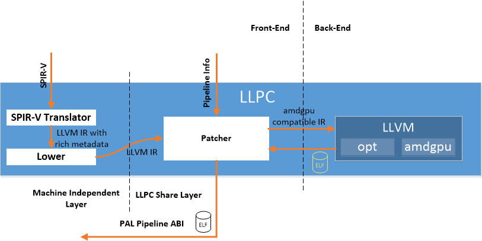

# Vulkan&reg; API Layer (XGL)

The Vulkan API Layer (XGL) translates Vulkan API commands into PAL commands. It compiles shaders that compose a particular `VkPipeline` object as a single entity using the LLVM-Based Pipeline Compiler (LLPC) library. 

LLPC builds on LLVM's existing shader compilation infrastructure for AMD GPUs to generate code objects compatible with PAL's pipeline ABI. It consists of three components: 

* SPIR-V translator is based on Khronos SPIRV-LLVM translator. It translates SPIR-V binary to LLVM IR with rich metadata. 

* Lower translates all LLVM compiler unsupported LLVM IR and metadata to function calls. 

Both SPIR-V translator and Lower are machine independent. 

* Patcher replaces all external function calls with LLVM compiler compatible LLVM IR according to the pipeline information. It calls LLVM and reorganizes LLVM compiler's output with PAL Pipeline ABI.  

## Third Party Software  
XGL contains code written by third parties:
* SPIRV-LLVM translator is distributed under the terms of University of Illinois/NCSA Open Source License. See icd/api/llpc/translator/LICENSE.TXT.  
* LLVM opt is distributed under the terms of University of Illinois/NCSA Open Source License. See icd/api/llpc/imported/llvm/opt/LICENSE.TXT.
* SPIRV-Tools is distributed under the terms of Apache License version 2.0. See /icd/api/llpc/translator/hex_float.h and bitutils.h.
